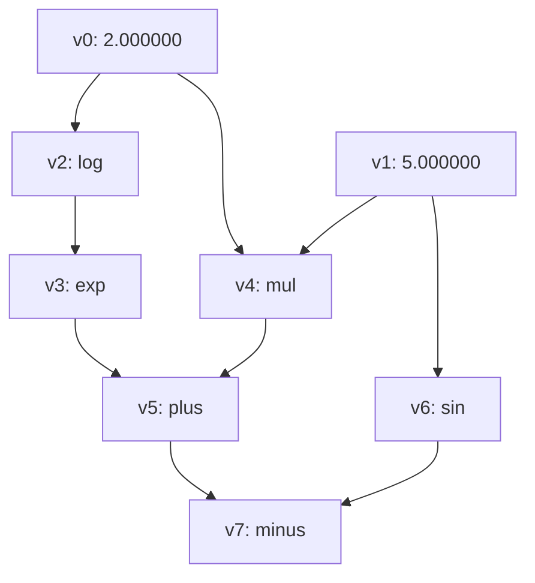

# Automatic Differeniation

## 计算图的构建

* 叶子结点，它是直接有值的，它的运算符为空，没有inpusts
* 对于非叶子结点，即通过运算生成的变量，通过运算符重载，在每一次计算生成新的变量时，都将它的inputs和运算符记录下来
* 对于任何一个非叶子结点，我们都可以通过其inputs和op来计算其最终的值，这个计算可以沿着计算路径展开下去
* 可以使用拓扑排序得到一个计算图的结点序列

## 反向传播

* 沿着拓扑排序得到的结点序列，反向进行梯度计算
* 如果一个结点，它的伴随列表（adjoint_vec）为空，则说明为反向传播的root，它的伴随梯度为1
* 如果伴随列表不为空，则可以对伴随列表中的梯度值求和，得到该结点的伴随梯度
* 对于有inputs的结点，我们利用op->ComputGraident来计算，它反传到输入结点的梯度，并存放到输入结点对应的伴随列表中

## 梯度清空

* 如果我们多次调用反射传播，会导致每个结点的伴随列表增长，结点的最终伴随梯度会累加
* 如果需要计算单次梯度，则每次计算前，需要将历史的的伴随列表进行清空

## 变量池

变量在整个计算图中可能被多次引用，生命周期非常难以管理，如果用智能指针，则会出现循环引用的问题，所以目前采用祼指针指向VariableImpl，而VariableImpl对象的创建与销毁则有全局static的一个VariablePool来管理，内部用一个map来存储堆上分配的所有VariableImpl。

## Operators

* 正向计算，由Value()接口触发，使用值进行计算
* 梯度计算还是符号计算，生成反射梯度传播的计算图
* 目前支持的运算是float上的：`+`、`-`、`*`、`/`、`sin`、`cos`、`ln`、`exp`